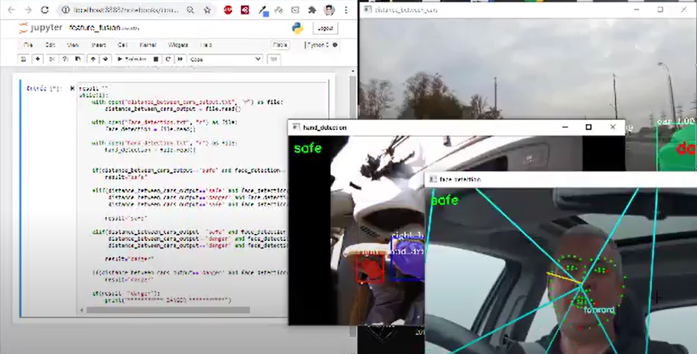

# driving_behaviours
This project contains:
* The segmentation and the detection of the driver's hands.
* Detection of the direction of the driver's face.
* Determination if a car is close or not.
* Decision fusion (Safe or Danger)

